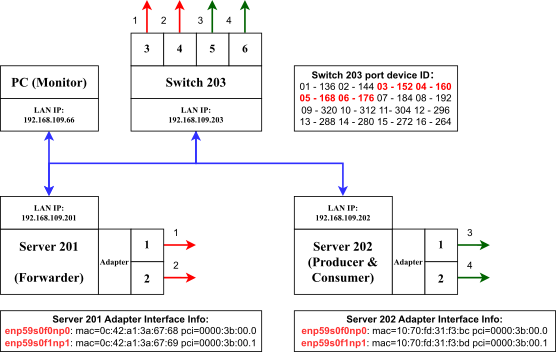
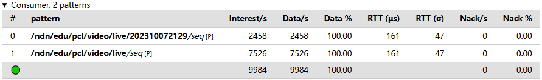

<h1 align="center">Pegasus: A Practical High-Speed Cross-Platform NDN Forwarder</h1>

<br />

<div align="center">
    
[Xingguo Long](mailto:longxg@pcl.ac.cn)<sup>1,2,3</sup>, Kun Huang<sup>2</sup>, Rongwei Yang<sup>2</sup>, Qingguo Dai<sup>2</sup>, [Zhenyu Li](https://zhenyulee.github.io/)<sup>1</sup>

<sup>1</sup> Institute of Computing Technology, Chinese Academy of Sciences

<sup>2</sup> Pengcheng Laboratory 

<sup>3</sup> University of Chinese Academy of Sciences

<br />

</div>

# 📌 Overview

<!-- **Pegasus** is currently under a peer-review process. Only a portion of the code is currently open-sourced for reproducing experimental results and referencing implementation details. Once Pegasus is accepted for publication, we will release all core code. -->

**Pegasus** is a high-speed NDN forwarding system architecture that combines servers and programmable switches.

# ⚙️ Prerequisites

Reference Devices:
- **Programmable switch**: Edgecore DCS810 with SDE 9.10.0
- **Servers**: Dell PowerEdge T640 with Ubuntu 22.04, DPDK 22.07.0 and ConnectX-5 MCX516A Ethernet adapter
- **PC (Monitor)**: locate at the same LAN with programmable switch and servers

Reference testbed topology: 



# 🚀 Pegasus Testbed Quick Setup

## 1. Optimal Parsable Name Format

Go to the repository [Pegasus-Traffic](https://github.com/NDN-PEGASUS/Pegasus-Traffic) and clone it to the backend server.

Follow the instructions in the README file to determine the optimal parsable name format based on real-world traffic, and generate `names.txt` as preparation for FIB insertion on the forwarder.

## 2. Pegasus Switch

Go to the repository [Pegasus-Switch](https://github.com/NDN-PEGASUS/Pegasus-Switch) and clone it to the programmable switch.

First, copy `pclndn.xml` and `types.xml` to `path/to/your/SDE/install/share/cli/xml`

Based on the optimal parsable name format obtained in the [Pegasus-Traffic](#1-optimal-parsable-name-format), modify the parser implementation in the data plane (`pclndndpv2.p4`).

To compile and install the data plane:
```shell
cd Pegasus-Switch/pclndndpv2/
./build.sh
./install.sh
```

To compile and start the control plane:
```shell
cd Pegasus-Switch/pclndncpv2/
./start_pegasus.sh
```

By control plane, offloading the bitmap for external servers and the MAC table for backend servers: 
```shell
pclndn
port add
bitmap add
group add key area 0

# Ports connected to backend servers
# Please modify according to your testbed topology
mac add server 0 dmac 0c:42:a1:3a:67:68 port 3/0 
mac add server 0 dmac 0c:42:a1:3a:67:69 port 4/0
```

If you want to stop the Pegasus switch: 
```shell
./stop_pcl_switchd.sh
```

## 3. Forwarder

Go to the repository [Pegasus-Server](https://github.com/NDN-PEGASUS/Pegasus-Server) and clone it to the backend server.

To compile and build:
```shell
cd Pegasus-Server/ndn-dpdk/
sudo pnpm install  # just for the first make
make clean 
NDNDPDK_MK_RELEASE=1 make 
sudo make install
```

Copy the `names.txt` file generated in [Pegasus-Traffic](#1-optimal-parsable-name-format) to the `Pegasus-Server/ndn-dpdk/sample/activate` directory. Then, offload the FIB entries, activate, and start the forwarder:
```shell
cd Pegasus-Server/ndn-dpdk/sample/activate
sudo pnpm install # just for the first run

# Note: Please modify relevant settings such as MAC address 
# according to your testbed topology before running the script below
sh fw-ndntestbed.sh
```

If you want to stop the forwarder:
```shell
sudo ndndpdk-ctrl systemd stop
```

Vistualize the monitor of forwarder on PC:
```shell
ssh -L 5201:127.0.0.1:3333 <forwarder's server name>@<forwarder's server LAN ip>
# Example
ssh -L 5201:127.0.0.1:3333 server201@192.168.109.201

cd Pegasus-Server/ndn-dpdk/sample/status
sudo pnpm install # just for the first run
sudo pnpm start
```
After launching the visualization, open a browser on the PC and visit `127.0.0.1:5201` to monitor the forwarder.

## 4. Producer

Go to the repository [Pegasus-Server](https://github.com/NDN-PEGASUS/Pegasus-Server) and clone it to the external server.

To compile and build: 
```shell
cd Pegasus-Server/ndn-dpdk/
sudo pnpm install  # just for the first make
make clean 
NDNDPDK_MK_RELEASE=1 make 
sudo make install
```

Activate and start the producer: 
```shell
cd Pegasus-Server/ndn-dpdk/sample/activate
sudo pnpm install # just for the first run

# Note: Please modify relevant settings such as MAC address 
# according to your testbed topology before running the script below
sh producer.sh
```

If you want to stop the producer: 
```shell
sudo ndndpdk-ctrl --gqlserver "http://127.0.0.1:3031" systemd stop
```

Vistualize the monitor of producer on PC: 
```shell
ssh -L 5203:127.0.0.1:3334 <producer's server name>@<producer's server LAN ip>
# Example
ssh -L 5203:127.0.0.1:3334 server202@192.168.109.202

cd Pegasus-Server/ndn-dpdk/sample/status
sudo pnpm install # just for the first run
sudo pnpm start --gqlserver "http://127.0.0.1:3031" --listen "127.0.0.1:3334"
```
After launching the visualization, open a browser on the PC and visit `127.0.0.1:5203` to monitor the producer.

## 5. Consumer

Go to the [Pegasus-Server](https://github.com/NDN-PEGASUS/Pegasus-Server) repository on the external server.

Activate and start the consumer:
```shell
cd Pegasus-Server/ndn-dpdk/sample/activate
sh consumer.sh <parsableRatio> <interval>

# Example: Consumer generates traffic with 75% parsable names at 10 Kpps
# Note: Please modify relevant settings such as MAC address 
# according to your testbed topology before running the script below
sh consumer.sh 75 "0.1ms"
```

If you want to stop the consumer:
```shell
sudo ndndpdk-ctrl systemd stop
```

Vistualize the monitor of consumer on PC:
```shell
ssh -L 5202:127.0.0.1:3333 <consumer's server name>@<consumer's server LAN ip>
# Example
ssh -L 5202:127.0.0.1:3333 server202@192.168.109.202

cd Pegasus-Server/ndn-dpdk/sample/status
sudo pnpm start
```
After launching the visualization, open a browser on the PC and visit `127.0.0.1:5202` to monitor the consumer:


# 🚀 Baseline Testbed Quick Setup

## 1. L2 Switch

Go to the repository [L2-Switch](https://github.com/NDN-PEGASUS/L2-Switch) and clone it to the programmable switch.

To compile and install the data plane:
```shell
cd L2-Switch/
./build.sh
./install.sh
```

Run the L2 switch:
```shell
./run_switchd.sh
```

Add and enable ports:
```shell
ucli
pm
port-add -/0 100G NONE
an-set -/- 2
port-enb -/-
```

## 2. Baseline Forwarder

Go to the repository [NDN-DPDK](https://github.com/usnistgov/ndn-dpdk) and clone it to the backend server.

To compile and build:
```shell
cd ndn-dpdk/
git checkout 0c34e8b
sudo pnpm install  # just for the first make
make clean 
NDNDPDK_MK_RELEASE=1 make 
sudo make install
```

Copy the `names.txt` file generated by [Pegasus-Traffic](#1-optimal-parsable-name-format), along with [`fw-ndntestbed-baseline.py`](https://github.com/NDN-PEGASUS/Pegasus-Server/blob/main/ndn-dpdk/sample/activate/fw-ndntestbed-baseline.py) and [`fw-ndntestbed-baseline.sh`](https://github.com/NDN-PEGASUS/Pegasus-Server/blob/main/ndn-dpdk/sample/activate/fw-ndntestbed-baseline.sh) from [Pegasus-Server](https://github.com/NDN-PEGASUS/Pegasus-Server), to the `ndn-dpdk/sample/activate` directory. Then, offload the FIB entries, activate, and start the forwarder:
```shell
cd ndn-dpdk/sample/activate
sudo pnpm install # just for the first run

# Note: Please modify relevant settings such as MAC address 
# according to your testbed topology before running the script below
sh fw-ndntestbed-baseline.sh 
```
The rest procedures are the same as in the Pegasus testbed. Please refer to the [Forwarder](#3-forwarder) section.

## 3. Producer

The procedures are the same as in the Pegasus testbed. Please refer to the [Producer](#4-producer) section.

## 4. Consumer

The procedures are the same as in the Pegasus testbed. Please refer to the [Consumer](#5-consumer) section.

After launching the visualization, open a browser on the PC and visit `127.0.0.1:5202` to monitor the consumer:


